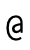
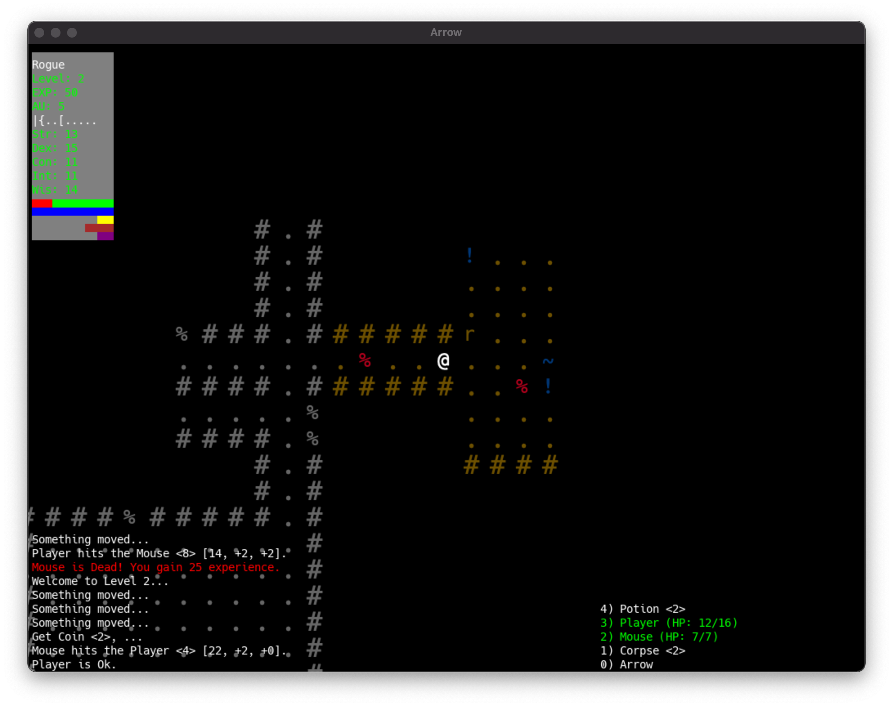

# Arrow

roguelike demo w/ Haskell

## Features

1. Tiles
1. `rogueDungeon` with `MonadRandom`
1. 3 Blind Mice
1. Camera follows `@`
1. HUD

## Usage
1. vi keys or ArrowKey Movement
1. r to reset the World
1. Fun

## Screenshot

## Author
"Joel E Carlson" &lt;joel.elmer.carlson@gmail.com&gt;
